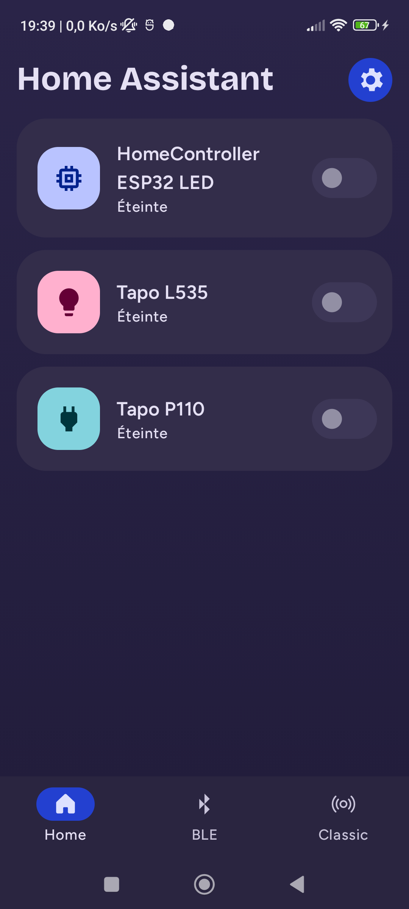
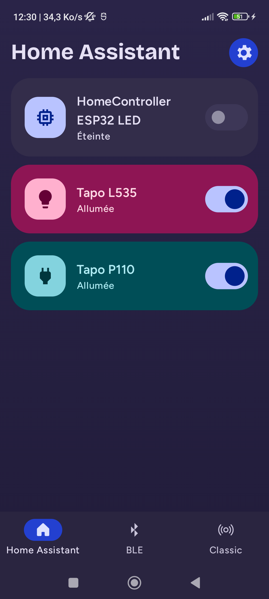
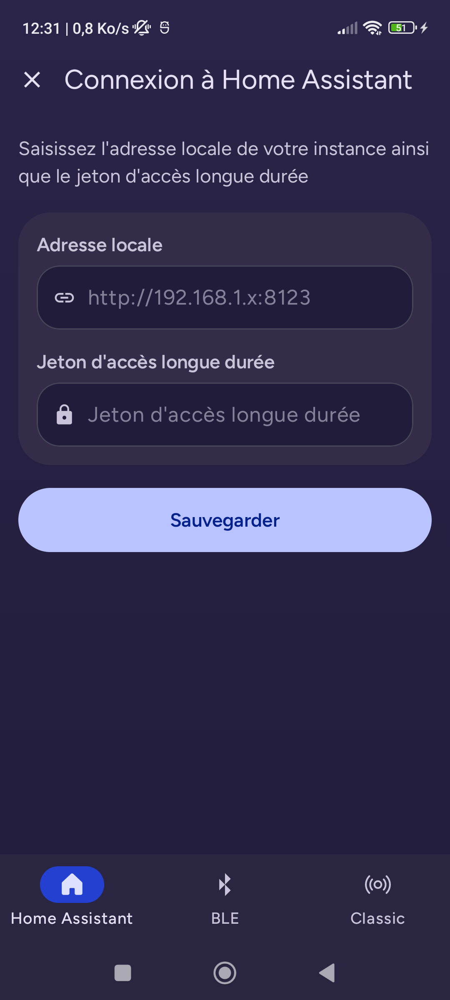
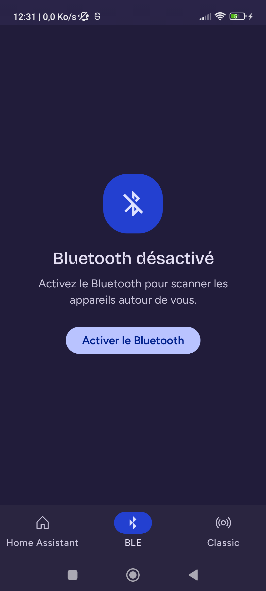
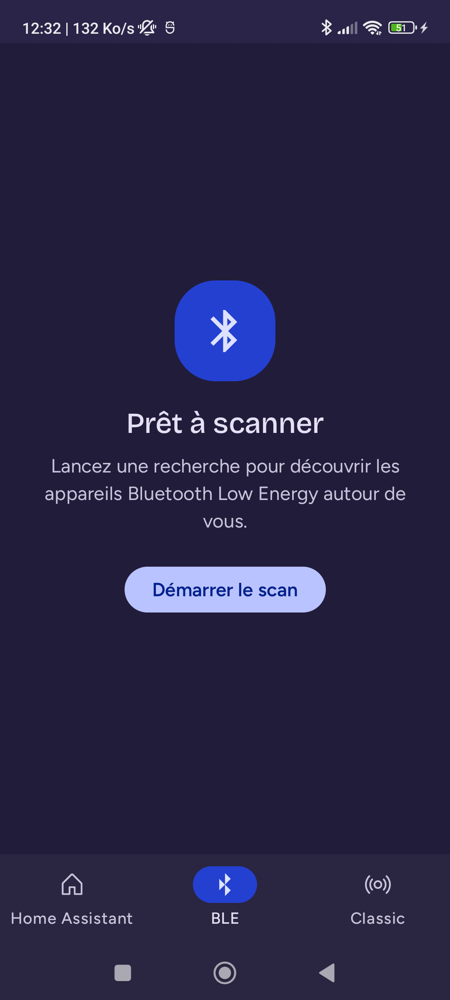
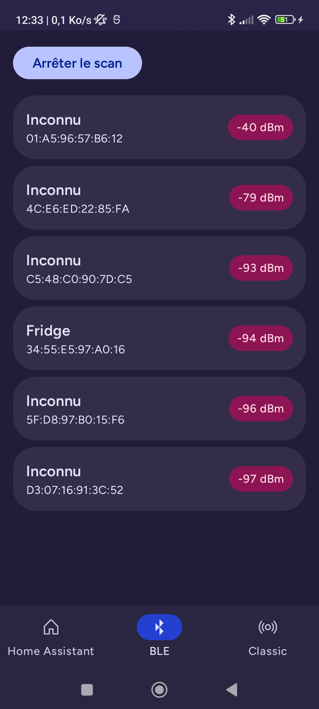
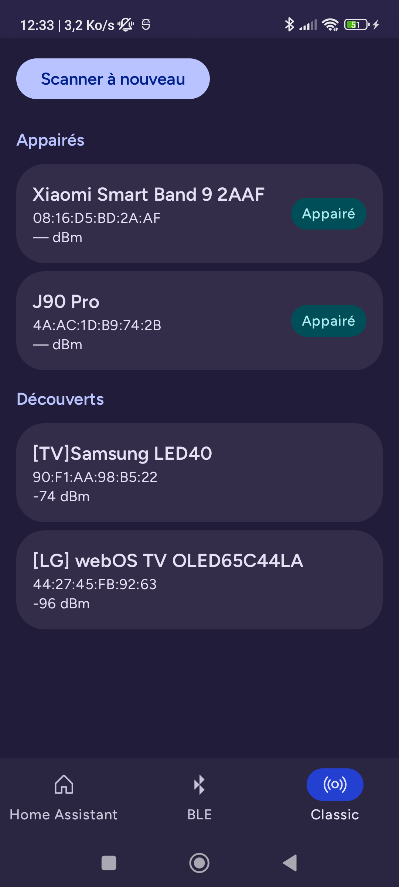

# Home Controller

A modular Android app to control smart-home devices from a single phone — **Home Assistant** entities over your local network, plus direct **Bluetooth Low Energy** and **Bluetooth Classic** discovery, including a custom **ESP32** peripheral.

> The in-app UI is currently in French; an English localization is planned (all user-facing text already lives in `strings.xml`).

---

## Screenshots

| Home Assistant — devices off | Home Assistant — devices on | Connection form |
|:---:|:---:|:---:|
|  |  |  |
| The device list (light/switch), pulled from Home Assistant. | Optimistic toggles with live WebSocket sync; each active card takes a different accent. | Local URL + long-lived access token, tested before saving. |

| BLE — Bluetooth off | BLE — ready to scan | BLE — scanning | Bluetooth Classic |
|:---:|:---:|:---:|:---:|
|  |  |  |  |
| Guard state driving the user to enable Bluetooth. | Idle state before a scan. | Live results, sorted and RSSI-stabilized. | Paired vs. discovered devices, in sections. |

---

## Features

- **Home Assistant control** — discovers controllable `light` / `switch` entities via the REST API, filters out auxiliary sub-entities, and shows them as cards.
  - Optimistic on/off toggles with rollback on failure.
  - **Real-time** state updates over a Home Assistant **WebSocket** (auto-reconnect with capped back-off).
  - Entity detail screen with a **brightness gauge** for dimmable lights.
  - First-run connection form (local URL + long-lived token), validated before saving; credentials stored in an encrypted DataStore.
- **Bluetooth Low Energy** — permission/adapter guard states, live scan with RSSI stabilization, and a control screen for a custom **ESP32** GATT peripheral (LED toggle + live counter notifications).
- **Bluetooth Classic** — device discovery split into *paired* and *discovered* sections.
- **Material 3 Expressive** design with a soft dark theme, edge-to-edge, and a per-tab navigation back stack (Navigation 3).

---

## Architecture

The project follows a **multi-module Clean Architecture** inspired by [Now in Android](https://github.com/android/nowinandroid): a clear separation between `app`, `feature`, and `core` layers, with dependencies pointing inward toward pure Kotlin models.

```
app  ──▶  feature:*  ──▶  core:data  ──▶  core:network
                    │                └─▶  core:datastore
                    ├──▶  core:ui  ──▶  core:designsystem
                    ├──▶  core:bluetooth
                    └──▶  core:model  ◀── (everyone depends on the pure model)
```

### Modules

| Module | Responsibility |
|---|---|
| `app` | Application entry point, DI setup, and the **Navigation 3** shell (bottom bar + per-tab back stacks). |
| `feature:homeassistant` | HA routing (config vs. entities), device list, entity detail, and connection form. |
| `feature:btlowenergy` | BLE scan screen and state machine. |
| `feature:btclassic` | Bluetooth Classic discovery screen. |
| `feature:devicedetail` | Control screen for the ESP32 peripheral (LED + counter). |
| `core:model` | Pure-Kotlin domain models — **no Android dependencies**. |
| `core:data` | Repository **facade interfaces** (`HomeAssistantEntities`, `HomeAssistantConfiguration`) and their implementations; the single source of truth. |
| `core:network` | Retrofit/OkHttp REST + WebSocket data sources for Home Assistant, `kotlinx.serialization`. |
| `core:datastore` | Encrypted DataStore persistence for the HA credentials. |
| `core:bluetooth` | Android BLE (scan + GATT/ESP32 client) and Bluetooth Classic discovery. |
| `core:designsystem` | Material 3 Expressive theme, colors, icons, and generic (model-agnostic) composables. |
| `core:ui` | Model-aware composites shared across features (device cards). |
| `core:testing` | Shared test utilities (e.g. `MainDispatcherRule`). |

### Design highlights

- **Framework-light ViewModels.** ViewModels depend on `core:data` facade interfaces (not Android `Context`), so they're covered by fast **JVM unit tests** with hand-written fakes.
- **Errors as string resources.** ViewModels carry user-facing errors as `@StringRes Int` in their `UiState`; the text is resolved in Compose via `stringResource`. This keeps the ViewModels Context-free, localizable, and testable.
- **Unidirectional data flow.** Each screen exposes an immutable `UiState` via `StateFlow` (`stateIn` + `WhileSubscribed`); the WebSocket lifecycle is bound to UI subscription.
- **Guard states as first-class UI.** Permissions and Bluetooth availability are modeled as explicit states rather than hidden side effects.

---

## Tech stack

| Area | Choice |
|---|---|
| Language | Kotlin `2.2.21` |
| Build | Android Gradle Plugin `9.2.1`, Gradle version catalog, KSP |
| UI | Jetpack Compose, **Material 3 Expressive** (`1.5.0-alpha23`), Compose BOM `2026.06.01` |
| Navigation | Navigation 3 (`androidx.navigation3`) |
| DI | Hilt `2.60.1` |
| Async | Coroutines / Flow `1.10.2` |
| Networking | Retrofit `3.0.0` + OkHttp (REST + WebSocket), `kotlinx.serialization` |
| Storage | Jetpack DataStore `1.2.1` (encrypted credentials) |
| Testing | JUnit, `kotlinx-coroutines-test`, fakes |

**SDK:** `minSdk 26` · `targetSdk 36` · `compileSdk 37`

---

## Getting started

### Requirements
- Android Studio (latest stable) with AGP 9 support
- JDK 17+
- A physical Android device (min. Android 8.0 / API 26) — Bluetooth features need real hardware

### Build & run
```bash
git clone <repo-url>
cd HomeController
./gradlew :app:assembleDebug
```
Or open the project in Android Studio and run the `app` configuration on your device.

### Connecting to Home Assistant
1. Open the **Home Assistant** tab.
2. Enter your instance's **local URL** (e.g. `http://192.168.1.20:8123`) and a **long-lived access token** (Home Assistant → *Profile → Security → Long-lived access tokens*).
3. The app tests the connection before saving. Your `light` and `switch` entities then appear in the list.

### ESP32 peripheral (optional)
The BLE control screen targets a custom ESP32 GATT profile (LED characteristic + counter notifications). Without matching firmware, the app still scans and lists nearby BLE/Classic devices.

---

## Testing

```bash
./gradlew testDebugUnitTest
```
ViewModels and repositories are covered by JVM unit tests using in-memory fakes of the `core:data` facades — no emulator or Robolectric required.

---

## Roadmap / notes

- English localization (the extraction to `strings.xml` is done; a `values-en/` translation is the next step).
- Extend controllable domains beyond `light` / `switch` (e.g. `fan`, `cover`).
- Device-registry-based entity grouping via WebSocket (replacing the current name-suffix heuristic).
